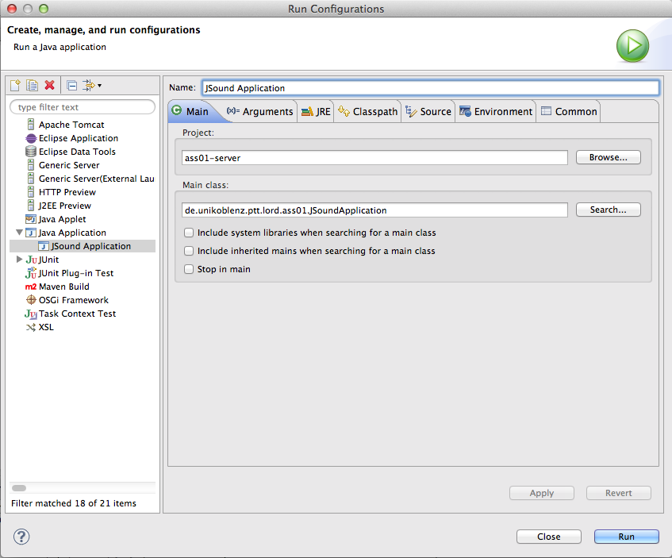
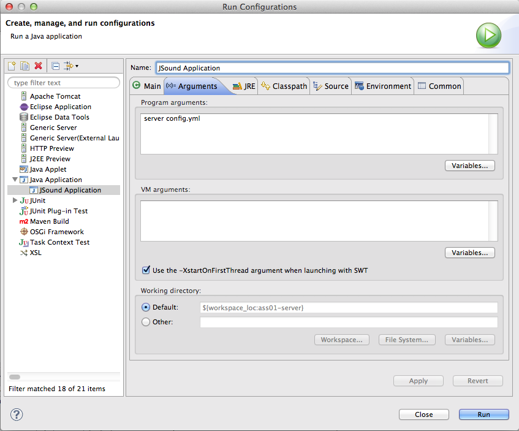

#JSOUND

##1 Requirements

We have used the following software in our project, if you miss any of it just follow the instructions below. Or you can skip till step 4 and use the provided binaries.

###1.1 Eclipse
If you already have a version of Eclipse, be sure that the Maven Integration for Eclipse Plugin is installed.

* <http://www.eclipse.org/downloads/>
* <https://www.eclipse.org/m2e/>

###1.2 Node.js

* <http://nodejs.org/>

###1.3 Git

* <http://git-scm.com/>

###1.4 Ruby

* <https://www.ruby-lang.org>

###1.5 Compass

Be sure that Ruby has been properly installed. Then run from the CLI `$ gem install compass`.

* <http://compass-style.org/>

##2 Project Setup

1. Clone the repository by typing `$ git clone https://github.com/sschauss/ptt.git` into the Terminal or use your favorite GUI Client (e.g. [SourceTree](http://www.sourcetreeapp.com/), [giggle](https://wiki.gnome.org/action/show/Apps/giggle), ...)
2. Import the ass01-server folder as an existing project into eclipse.
3. Create a new Run Configuration
	1. Project: `ass01-server`, Main Class: `de.unikoblenz.ptt.lord.ass01.JSoundApplication` 
	
	2. Program Arguments: `server config.yml`
	
4. Then run the build script in the root folder with `$ sh build.sh`

##3 Usage

###3.1 Server

Just run the Run Configuration you've set up in step 2.3 to start the server.

Options:

- clientId: The client ID generated by [registering](http://soundcloud.com/you/apps) a SoundCloud application.
- jerseyClientConfiguration.timeout: The time the jersey client waits for a request to finish.
- everything else: Take a look at the Dropwizard [documentation](http://dropwizard.github.io/dropwizard/manual/configuration.html).

The is written in config.yml [YAML](http://www.yaml.org/spec/1.2/spec.html). It is also possible to pass a JSON configuration file.

###3.2 Client

Navigate to the ass01-client folder, from there type `$ grunt serve` into the Terminal.

Now you can access the client on <http://localhost:9000>. Grunt intercepts all requests to `/api` and pass them to <http://localhost:8080>. 

A watch task is running in the background, every time you edit a file in ass01-client/app the grunt server compiles CoffeeScript and SASS files if necessary and the webapp will reload.

###3.3 Binaries

Navigate to ass01-bin and run `$ sh run.sh` from the CLI. Then open your Browser on <http://localhost:8080>.

